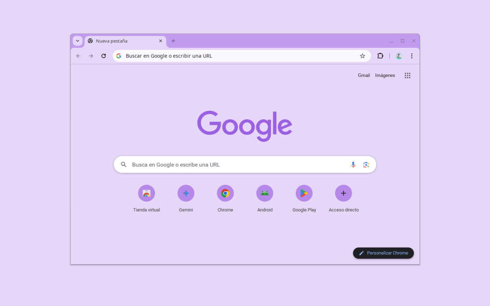

# Minimalist Blackberry Juice 🫐

A minimal Chrome theme in a calm, violet palette, by Miguel Euraque.

A muted purple frame with a paler lavender toolbar and new tab page, and a cool gray for the text. It leans toward the deeper, berry-toned purple of blackberry juice instead of a bright violet.

## Features

- **Palette:** muted violet frame, pale lavender surfaces, cool gray text
- **Minimalist design:** clean and uncluttered
- **Easy installation:** Chrome Manifest V3
- **Gentle on the eyes:** low-contrast colors that stay easy to read

## Installation

### Chrome Web Store (recommended)

1. Visit the [Minimalist Blackberry Juice](https://chromewebstore.google.com/detail/minimalist-blackberry-jui/nhcagbepkhjbknffbbjhbplokmcbgikb) page in the Chrome Web Store.
2. Click **Add to Chrome**.

### From source

1. Clone this repository.
2. Open `chrome://extensions` and turn on Developer mode.
3. Click **Load unpacked** and select the theme folder.
